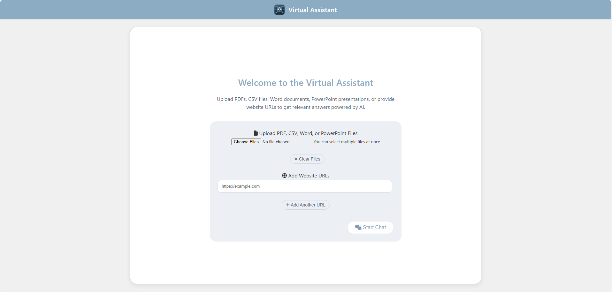
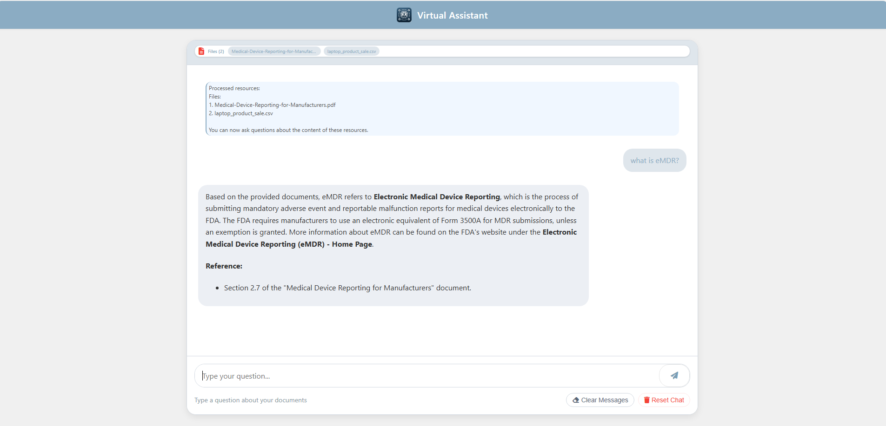

# RAG Chatbot with Azure OpenAI

A Flask-based Retrieval-Augmented Generation (RAG) chatbot that answers questions based on uploaded documents and websites.

[](https://portal.azure.com/#create/Microsoft.Template/uri/https%3A%2F%2Fraw.githubusercontent.com%2ketanvh%2Fdocbot%2Fmain%2Fazure.json)

## Screenshots

### Upload Interface

*The file upload interface where users can add documents and website URLs for the chatbot to analyze.*

### Chat Interface

*The chat interface showing a conversation with the document-aware assistant.*

## Features

- Chat interface with message history
- Upload multiple document types for question answering:
  - PDF files 
  - CSV files (converted to markdown tables)
  - Word documents (.docx, .doc)
  - PowerPoint presentations (.pptx, .ppt)
- Add multiple website URLs for information extraction
- Customizable appearance through environment variables
- Multi-user support (isolated sessions)
- No server-side storage of documents (everything processed in-memory)
- Azure OpenAI integration

## Setup

### Local Development

1. Clone this repository
2. Create a virtual environment:
   ```
   python -m venv venv
   venv\Scripts\activate  # On Windows
   source venv/bin/activate  # On macOS/Linux
   ```
3. Install dependencies:
   ```
   pip install -r requirements.txt
   ```
4. Copy the `.env.example` file to `.env` and set your Azure OpenAI credentials:
   ```
   AZURE_OPENAI_ENDPOINT=your_endpoint_here
   AZURE_OPENAI_API_KEY=your_api_key_here  
   AZURE_OPENAI_DEPLOYMENT_NAME=your_deployment_name_here
   AZURE_OPENAI_API_VERSION=2023-05-15
   
   # Document Intelligence for intelligent document processing
   AZURE_DOCUMENT_INTELLIGENCE_ENDPOINT=your_doc_intelligence_endpoint_here
   AZURE_DOCUMENT_INTELLIGENCE_API_KEY=your_doc_intelligence_key_here
   
   APP_TITLE=RAG Chatbot
   APP_WELCOME_MESSAGE=Welcome to the RAG Chatbot. Upload PDFs or provide website URLs to get relevant answers.
   APP_LOGO_PATH=static/images/logo.svg
   APP_PRIMARY_COLOR=#007bff
   
   SYSTEM_PROMPT=You are a helpful assistant answering questions based on the provided documents. If the answer is not in the documents, say so clearly instead of making up information.
   ```

### Azure Deployment (One-Click)

1. Click the "Deploy to Azure" button at the top of this README
2. Fill in the required parameters:
   - **Web App Name**: Choose a unique name for your web app
   - **Location**: Select an Azure region
   - **SKU**: Choose the pricing tier for your app (default: B1)
   - **Azure OpenAI Endpoint**: Your Azure OpenAI service endpoint URL
   - **Azure OpenAI API Key**: Your API key
   - **Azure OpenAI Deployment Name**: Your model deployment name
   - **Azure Document Intelligence Endpoint**: Your Azure Document Intelligence endpoint URL
   - **Azure Document Intelligence API Key**: Your Document Intelligence API key
3. Click "Review + Create" and then "Create" to deploy the application
4. Once deployment is complete, you can access your app at `https://<web-app-name>.azurewebsites.net`

### Azure Deployment (GitHub Actions)

To set up continuous deployment from GitHub:

1. Fork this repository
2. In your Azure portal, create a new Web App
3. Go to the "Deployment Center" in your Web App settings
4. Configure GitHub Actions for deployment
5. Add the following secrets to your GitHub repository:
   - `AZURE_WEBAPP_NAME`: The name of your Azure Web App
   - `AZURE_WEBAPP_PUBLISH_PROFILE`: The publish profile from your Azure Web App
6. Push changes to the main branch to trigger deployment

## Running the Application

Start the Flask application:

```
python app.py
```

Then open your browser and navigate to:
```
http://localhost:5000
```

## Usage

1. When the app loads, you'll see an option to upload files and enter website URLs
2. Upload files (PDFs, CSVs, Word documents, PowerPoint presentations) and/or provide URLs (both are optional)
3. Click "Start Chat" to begin the conversation
4. Ask questions in the chat input
5. Use the "Clear Messages" button to preserve uploaded documents but clear the conversation history
6. Use the "Reset Chat" button to reset and start a new session

## Customization

You can customize the following through the `.env` file:

- `APP_TITLE`: The title shown in the browser and header
- `APP_WELCOME_MESSAGE`: Welcome message shown to users
- `APP_LOGO_PATH`: Path to your custom logo (relative to the static folder)
- `APP_PRIMARY_COLOR`: Primary color for the UI (hex code)
- `SYSTEM_PROMPT`: The system prompt used for the AI assistant

## Architecture

- **Frontend**: HTML, CSS, and JavaScript
- **Backend**: Flask (Python)
- **AI**: Azure OpenAI API
- **Document Processing**: 
  - PDFs: PyMuPDF
  - CSV: Python's built-in csv module (converted to markdown tables)
  - Word Documents: python-docx
  - PowerPoint: python-pptx
  - Websites: BeautifulSoup

## Note

This application doesn't store documents on the server. All document content is processed in-memory and stored in the user's session for the duration of their conversation.